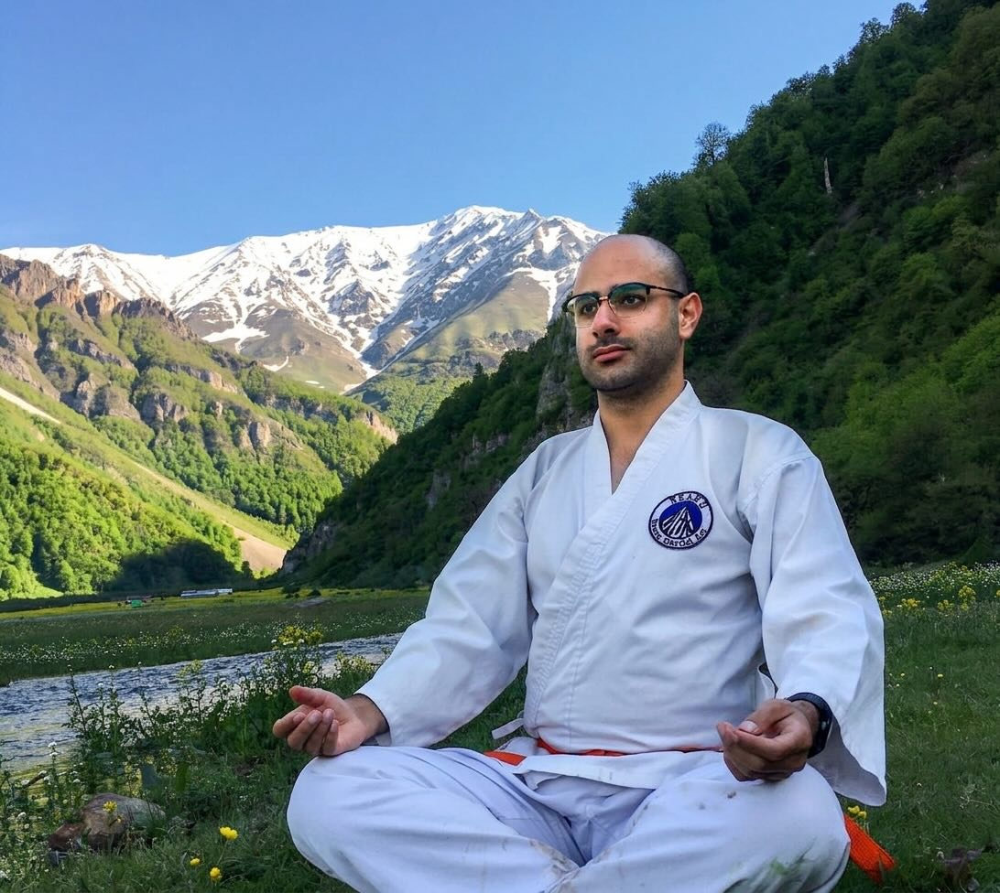

### 💻 Senior Android Engineer

7+ years building consumer apps at scale — Jetpack Compose migrations, modular architecture, and developer productivity. 500+ ⭐ across open source · 2 conference talks · 14 mentees.

🤔 Philosophus · 🍀 Life coach · 🚴🏻 Cyclist · 🧘🏻‍♂️ Meditator · 🥋 Martial artist · 🏔 Mountaineer

 

---

### ✍️ Latest articles
<!-- MEDIUM-POSTS:START -->
- [Debugging Jetpack Compose &lpar;Based on true story! &rpar;](https://proandroiddev.com/debugging-jetpack-compose-based-on-true-story-5592eb01e0?source=rss-8b2f28edbdea------2)
- [Kotlin scope functions for dummies!](https://blog.kotlin-academy.com/kotlin-scope-functions-for-dummies-cb8c8970b8d9?source=rss-8b2f28edbdea------2)
- [Migrate from MVVM to MVI](https://proandroiddev.com/migrate-from-mvvm-to-mvi-f938c27c214f?source=rss-8b2f28edbdea------2)
- [An introduction about Preview in Jetpack Compose](https://proandroiddev.com/an-introduction-about-preview-in-jetpack-compose-b72a96daac35?source=rss-8b2f28edbdea------2)
<!-- MEDIUM-POSTS:END -->

---

### 🎥 YouTube

- [**Code with Kaaveh**](https://www.youtube.com/@codewithkaaveh) — Android engineering
- [**With Kaaveh**](https://www.youtube.com/@withkaaveh) — life, mindset, conversations
- [**Cycling with Kaaveh**](https://www.youtube.com/@cyclingwithkaaveh) — cycling tutorials: gear, nutrition, and riding tips
- [**RunningWithKaaveh**](https://www.youtube.com/@RunningWithKaaveh) — running tutorials: technique, training, and hacks
- [**MyImmigration**](https://www.youtube.com/@My_Immigration) — my immigration journey
- [**Übermensch**](https://www.youtube.com/@%C3%9CbermenschFa) — longevity and health

#### Latest videos
<!-- YOUTUBE-VIDEOS:START -->
- [📺 I Let Claude Code Build My Android TV App — Here&#39;s What Happened](https://www.youtube.com/watch?v=s6VDJv9mD0k)
- [An introduction about Preview in Jetpack Compose](https://www.youtube.com/watch?v=Q8-Vixwq2pM)
- [Migrate from JUnit5 to Kotest 🐊](https://www.youtube.com/watch?v=-rVPOxuqIEg)
- [Migrate from ROOM Database to SQLDelight 2](https://www.youtube.com/watch?v=A7bWCrCXijw)
- [Speed up with KSP &lpar;Kotlin Symbol Processing&rpar;](https://www.youtube.com/watch?v=fUAk5-xuAUc)
- [Coroutines VS. Threads](https://www.youtube.com/watch?v=hjASLkHz-8k)
<!-- YOUTUBE-VIDEOS:END -->

---

<strong>📻 Podcasts</strong>

- [**WonderLand**](https://anchor.fm/wonderlandpod)
- [**Journal Club**](https://shows.acast.com/journal-club)
- [**The Voice of My Books**](https://anchor.fm/the-voice-of-my-books)
- [**Mushin**](https://shows.acast.com/mushin)
- [**Kapsoul**](https://anchor.fm/kapsoul)

---

